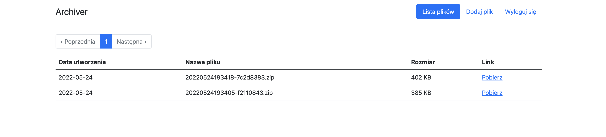

# Archiver

Archiver is an application that helps in the safe sending of attachments in e-mail communication. The user can easily upload one or more files, which will be compressed and encrypted with a random password. Thanks to this, the user can send the link to the attachments by e-mail, and the password to the recipient by another method of communication (e.g. by SMS).

## Table of contents
* [Screenshots](#screenshots)
* [Technologies](#technologies)
* [Features](#features)
* [Status](#status)

## Screenshots



## Technologies
* ruby 2.7.0
* rails 6.1.4
* bootstrap 5
* grape 1.6

## Features
List of features
* User can sign up and sign in
* User can upload files and download them zipped in one encrypted file
* API made with grape

## How to run

```bash
bundle install
bundle exec rails db:migrate
bundle exec rails s
```

## Tests

```
bundle exec rspec
```
